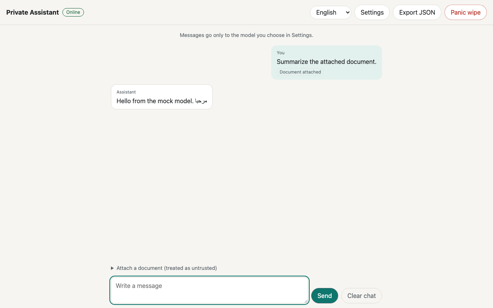
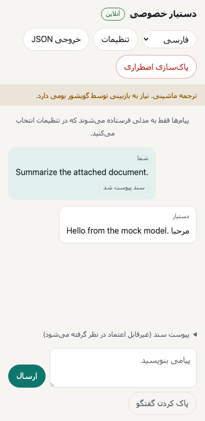
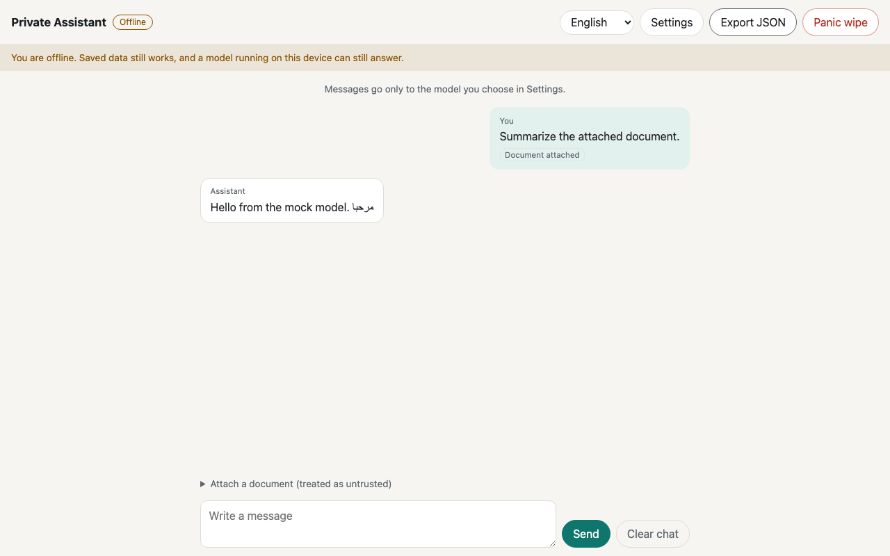

# AI Hack for Freedom III: Prep Kit

A reusable, privacy-first building kit for **AI Hack for Freedom III** (Washington DC, September 24-25, 2026), where developers pair with activist "captains" living under or fighting authoritarian regimes and build a working tool in about a day and a half.

> **Public snapshot.** This is a cleaned copy of a private working repo. Speculation naming individuals who might attend, and personal infrastructure details, were removed before publishing.

> **Status: kit complete and verified (2026-09-14).** Built by a 5-agent [ruflo](https://github.com/ruvnet/claude-flow) swarm (see [`docs/swarm/SWARM.md`](docs/swarm/SWARM.md)) and independently re-verified by the coordinator: 260 unit and script tests, 32 browser checks, opsec audit PASS. Nothing has been deployed. What still needs a human (real model servers, a real wallet payment, Docker build, phone install, native translation review) is listed under [What still needs a human](#what-still-needs-a-human).

---

## Honesty statement (read before the pitch)

The captain's problem is unknown until the event, so **this repo contains no project-specific code.** It holds generic building blocks of the same kind as a library or boilerplate: an offline app shell, Nostr and Lightning helpers, a security audit script, research, and a runbook. Anything built for a specific captain at the event lives in its own repo, created on site.

On pitch day we state plainly what was prepared before the event (this kit, publicly timestamped by its git history) and what was built during it. The organizers' rule on pre-existing code has not been confirmed; see open questions in [`docs/research/`](docs/research/).

---

## The event at a glance

| | |
|---|---|
| **Event** | AI Hack for Freedom III ([aihackforfreedom.org](https://www.aihackforfreedom.org/)) |
| **Hosts** | AI Freedom Lab, Human Rights Foundation (HRF), National Endowment for Democracy (NED), University of Maryland School of Public Policy |
| **Welcome reception** | Wednesday, September 23, 2026 |
| **Build days** | Thursday, September 24 and Friday morning, September 25 |
| **Team pitches** | **Friday, September 25, 1:30 PM ET** (doors 1:00 PM, judging 3:00 PM, winners 3:30 PM) |
| **Venue** | National Endowment for Democracy, 1201 Pennsylvania Ave NW, Suite 1100, Washington, DC 20004 |
| **Teams** | 1 activist captain + 1 or 2 developers |
| **Prizes** | $25k pool paid in bitcoin (edition II split: $25k / $15k / $5k, $1k to every other team) |
| **Real build window** | About 1.5 days. Anything not working by Friday around 12:30 PM does not exist. |

### Judging criteria (from past editions)

| Edition | Criteria |
|---|---|
| II (Nashville, May 2026) | 1. Scale of the problem addressed. 2. Integration of AI tools. 3. Quality of technical execution. |
| I (Austin, Jan 2026) | Scale and impact of the problem, execution quality, adoption of the tool by users outside the team. |

Standout tools get considered by AI Freedom Lab for follow-on funding, so a live URL that real people can use matters.

### What has won before

| Ed. | Place | Project | Captain | What made it work |
|---|---|---|---|---|
| I | 1st | [Stringer Safety](https://stringersafety.com) | Anjan Sundaram | Journalist safety app: trusted contacts, one-tap SOS, encrypted AI via Maple |
| I | 2nd | [Pathos](https://pathos.place/) | Leopoldo Lopez (Venezuela) | Nostr community reporting with bitcoin rewards (Breeze SDK, Bitchat offline) |
| I | 3rd | [Corruption Disrespector](https://www.corruptiondisrespector.com) | Anna Chekhovich (Navalny's FBK) | Multilingual document entity extraction and network graphs |
| II | 1st | [Tarkus](https://tarkus-phi.vercel.app/) | Jhanisse Vaca-Daza (Bolivia) | Self-hostable AI lesson generator, live Q&A, trainer feedback agent |
| II | 2nd | [Zuka](https://zuka.live/) | Anaise Kanimba (Rwanda) | AI avatar identity protection, Nostr publishing, bitcoin wallet |
| II | 3rd | Roshan | Roya Mahboob (Afghanistan) | Offline-capable AI learning companion for girls denied school |

**Recurring ingredients:** private or local AI, offline and low-bandwidth operation, Nostr for censorship-resistant publishing, bitcoin/Lightning for money that cannot be frozen, self-hostable deploys, one-button simplicity for non-technical users, and a captain who can say how many real people will use it next month.

Full sourced notes: [`docs/research/COORDINATOR_FINDINGS.md`](docs/research/COORDINATOR_FINDINGS.md) and [`docs/research/INTEL.md`](docs/research/INTEL.md).

---

## What is in this repo

```
ai-hack-for-freedom/
├── README.md                     you are here
├── LICENSE                       MIT
├── docs/
│   ├── BRIEF.md                  shared brief every swarm agent reads first
│   ├── setup/ACCOUNTS.md         Maple AI, Lightning wallet (NWC), Nostr demo identities
│   ├── research/
│   │   ├── COORDINATOR_FINDINGS.md   verified facts + sources gathered before the swarm
│   │   └── INTEL.md              captains, past teams, toolchain, problem-archetype bank
│   ├── security/
│   │   └── ACTIVIST_THREAT_CHECKLIST.md  threat model + per-app checklist + honest pitch claims
│   ├── runbook/
│   │   ├── EVENT_DAY_RUNBOOK.md  T-10 days through Friday pitch, hour by hour
│   │   ├── CAPTAIN_INTAKE.md     20-minute captain interview + one-page spec template
│   │   ├── PITCH_TEMPLATE.md     3- and 5-minute pitch keyed to the judging criteria
│   │   ├── SUBMISSION_CHECKLIST.md
│   │   └── SWARM_PLAYBOOK.md     when a swarm helps at the event and when it hurts
│   ├── img/                      starter screenshots from the browser check
│   └── swarm/
│       ├── SWARM.md              swarm config, roster, timeline, final verification
│       ├── AGENT_PROMPTS.md      exact assignment prompts (re-run the swarm from these)
│       └── memory-export.json    snapshot of ruflo shared memory
├── src/
│   ├── starter/                  offline-first PWA + private LLM client + i18n/RTL + panic wipe
│   └── rails/                    Nostr identity/publish/DM + Nostr Wallet Connect Lightning
├── scripts/
│   ├── opsec-audit.sh            flags telemetry, CDNs, leaked keys, source maps
│   └── event-day-swarm.sh        spins up a build swarm from a captain spec
└── tests/
    ├── opsec/                    fixture tests for opsec-audit.sh
    ├── runbook/                  dry-run tests for event-day-swarm.sh
    └── starter-e2e/              headless Chromium check of the built starter app
```

### Component status

| Component | Owner agent | Status | Verified by |
|---|---|---|---|
| `docs/BRIEF.md` | coordinator | Done | n/a |
| `docs/setup/ACCOUNTS.md` | coordinator | Done (plus no-KYC Maple, Breez key, Tinfoil backup) | Sources checked 2026-09-13/14 |
| `docs/research/COORDINATOR_FINDINGS.md` | coordinator | Done | Sources linked inline |
| `docs/research/INTEL.md` | intel | Done (12 archetypes, toolchain, rules signal) | Sources tagged VERIFIED / INFERRED inline; gaps backfilled in `COORDINATOR_FINDINGS.md` section 8 |
| `docs/security/ACTIVIST_THREAT_CHECKLIST.md` | opsec | Done (5 non-negotiables, 9 checklist areas, honest pitch claims) | STATUS lists verified results, known false positives, and misses |
| `scripts/opsec-audit.sh` + `tests/opsec/` | opsec | Done (inline `opsec-audit: allow <reason>` marker, 2 MB minified files in 2.6 s) | `tests/opsec`: 53 passed, 0 failed (macOS; Linux untested) |
| `src/starter/` | starter | Done (vanilla TS + Vite, no runtime deps; LLM client, i18n/RTL with per-message `dir=auto`, panic wipe, PWA, Docker + Cloudflare configs) | Coordinator rerun: 47/47 tests, build OK, 14.1 KB JS gzipped incl. service worker, audit PASS, wrangler dry run OK, browser check 31/32 (1 known harness limit) |
| `src/rails/` | rails | Done (nostr-tools 2.25.2 only runtime dep; NIP-17/NIP-44 DMs; NWC; LNURL; zaps) | Coordinator rerun: 81/81 tests, build OK, opsec audit PASS; live read-only relay smoke OK |
| `docs/runbook/*` | runbook | Done (all 5 docs) | Each doc ends with a STATUS of verified vs dry-run items |
| `scripts/event-day-swarm.sh` + `tests/runbook/` | runbook | Done | `tests/runbook`: 79 passed, 0 failed, ruflo never called |

---

## Components

### `src/starter`: the 5-minute app shell

Copy this folder Thursday morning and you have a deployable, installable, private AI app to build the captain's idea on.

| Streaming chat with an untrusted document | Farsi, right-to-left, 400px phone | Network off |
|---|---|---|
|  |  |  |

*Screenshots from the headless browser check against a mock model server, not a real model.*

- **Vite + TypeScript**, 14.1 KB of JavaScript gzipped (budget was 50 KB).
- **Offline-first PWA:** manifest, service worker app-shell cache, visible offline indicator.
- **Private LLM client:** OpenAI-compatible streaming chat with presets for local Ollama, llama.cpp, Maple Proxy (encrypted AI), or any custom endpoint. Base URL, model, and key are set at runtime and stored only on the device.
- **Untrusted-content fencing** to reduce prompt injection when AI reads documents from adversaries.
- **i18n with automatic RTL**, UI strings for English, Spanish, Farsi, Arabic, Russian (non-English machine-drafted, needs native review).
- **Export and Panic Wipe:** one button clears local storage, IndexedDB, caches, and service workers.
- **Zero third-party runtime requests:** system fonts, no CDNs, no analytics.
- **Deploy both ways:** Docker (self-host) and Cloudflare Workers static assets.
- **Browser-verified** with `tests/starter-e2e/browser-check.cjs`: real Chromium, production CSP, mock SSE model server. It checks service worker, Fetch models, streaming, Export, RTL, offline shell, and panic wipe, and confirms zero third-party requests, CSP violations, and console errors.
- **Not verified yet:** a real Maple Proxy or Ollama server, a Docker image build, an actual Cloudflare deploy, native-speaker review of translations. `navigator.onLine` also cannot detect wifi with no internet (a captive portal shows "Online").

### `src/rails`: freedom rails

Two of six past podium teams were built on these rails.

- **Nostr:** key generation and import (nsec/npub), multi-relay publish with per-relay acks ("published to 3 of 5 relays"), subscriptions, profiles, and private DMs (NIP-17 gift wrap with NIP-44 encryption where supported).
- **Bitcoin:** Nostr Wallet Connect (NIP-47) for invoices, payments, and balance; Lightning Address (LNURL-pay) resolution; NIP-57 zap requests. The app never holds a seed phrase.
- Typed API with input validation at the boundary, fully offline mocked tests.
- Requires **Node 20.19+** (nostr-tools crypto); running the tests needs **Node 22.12+**.
- Fixes a real crash: with Node 22's built-in WebSocket, one unreachable relay made nostr-tools and undici call each other until the stack overflowed. `RelayPool` guards `close()`, with a regression test.
- Not built yet: NIP-42 relay AUTH, NIP-07/46 signers, BOLT11 signature checks. Untested: a real NWC wallet, a real LNURL server, publishing, browser runtime.

### `scripts/opsec-audit.sh`

Run it against any project before the pitch: `scripts/opsec-audit.sh path/to/app [--strict]`. It flags analytics SDKs, external CDN and font requests, plaintext HTTP, likely secrets (including `nsec1` keys), secret-ish values in logs or `localStorage`, stray `.env` files, and source maps in build output. Exit code 0 means clean, 1 means findings, 2 means bad usage.

### `docs/runbook`

The human side: what to do from now until Friday, how to interview a captain in 20 minutes and turn that into a frozen spec, go/no-go checkpoints, a scope-cut ladder, failure playbooks (wifi down, AI provider down, deploy broken), and a pitch structured one slide per judging criterion.

---

## Verify the kit yourself

Requires Node 20.19+ (22.12+ for the rails tests). From the repo root:

```bash
(cd src/rails && npm ci && npm test && npm run build)          # 81 tests
(cd src/starter && npm ci && npm test && npm run build)        # 47 tests, 14.1 KB JS gzipped
bash tests/opsec/test-opsec-audit.sh                           # 53 tests
bash tests/runbook/test-event-day-swarm.sh                     # 79 tests, never calls ruflo
bash scripts/opsec-audit.sh .                                  # expect PASS, 0 HIGH
node tests/starter-e2e/browser-check.cjs                       # 32 browser checks (1 known harness limit)
(cd src/starter && npx wrangler deploy --dry-run)              # validates Cloudflare config, uploads nothing
```

Last full run: 2026-09-14 on macOS, Node 22.18. Results are recorded in [`docs/swarm/SWARM.md`](docs/swarm/SWARM.md).

---

## What still needs a human

Do these during the dry run (target Mon Sep 14 to Wed Sep 16), after the accounts in [`docs/setup/ACCOUNTS.md`](docs/setup/ACCOUNTS.md) exist:

- [ ] Point `src/starter` Settings at the real Maple Proxy (`http://localhost:8080/v1`), click Fetch models, send a message. Confirm whether the desktop proxy sends CORS headers; if not, run the Docker proxy with `MAPLE_ENABLE_CORS=true`.
- [ ] Use `src/rails` to create a real invoice against your Coinos NWC string, and send a DM plus a small zap between the two demo Nostr identities.
- [ ] Start Docker Desktop and run `docker compose up --build` in `src/starter` (the Dockerfile runs `caddy validate`).
- [ ] Deploy `src/starter` once to a throwaway Cloudflare Workers URL, open it on your phone over cellular, install it to the home screen, then toggle airplane mode.
- [ ] Ask a native speaker to skim the Farsi or Arabic strings (currently machine-drafted).
- [ ] `src/starter/.env.example` is not included. Its variables (`HOST_PORT`, `CONNECT_SRC`, `CLOUDFLARE_ACCOUNT_ID`, `CLOUDFLARE_API_TOKEN`) are documented in `src/starter/README.md`.
- [ ] Email the organizers the three open rules questions in [`docs/research/INTEL.md`](docs/research/INTEL.md) section 3.
- [ ] Optional: request a Breez API key if an in-app wallet is plausible.

Known limit: `navigator.onLine` cannot detect wifi without internet (a captive portal still shows "Online"), and Playwright cannot emulate offline after a reload, which is the one expected browser-check failure.

---

## Event-day quick start

1. **Wednesday night:** run [`docs/runbook/CAPTAIN_INTAKE.md`](docs/runbook/CAPTAIN_INTAKE.md) with your captain and save the answers as `docs/spec.md` in the new event repo.
2. **Thursday 8 AM:** create the event repo, copy `src/starter` (and `src/rails` if the idea needs Nostr or payments).
3. `npm install && npm run dev`, open Settings, point the LLM client at the Maple Proxy or a local model.
4. Optional: `scripts/event-day-swarm.sh docs/spec.md --dry-run` to preview a parallel build swarm, then run it for real.
5. **By Thursday 6 PM:** deployed to a real URL. **By 10 PM:** someone outside the team has used it.
6. **Friday noon:** `scripts/opsec-audit.sh` passes, phone test over cellular, backup demo video recorded.

---

## Accounts to set up before the event

Step-by-step in [`docs/setup/ACCOUNTS.md`](docs/setup/ACCOUNTS.md). Summary:

| Account | Why | Cost | Do by |
|---|---|---|---|
| Maple AI Pro + desktop Local Proxy | Encrypted AI via an OpenAI-compatible API | $20/month | Sat Sep 19 |
| Coinos wallet with an NWC string | Real Lightning invoices and payments in demos | Free + about $5-10 of sats | Sat Sep 20 |
| Two throwaway Nostr identities (`nak`) | Live DM and zap demos between two accounts | Free | Sat Sep 20 |
| Phone hotspot | Venue wifi fallback (never a home server) | n/a | Before travel |

---

## How this kit was built

A ruflo swarm, hierarchical topology, 6 max agents (1 coordinator + 5 specialists), shared memory namespace `ai-hack-freedom`. Every agent read [`docs/BRIEF.md`](docs/BRIEF.md) and owned a separate set of paths so they could work in parallel without conflicts. The exact prompts are saved in [`docs/swarm/AGENT_PROMPTS.md`](docs/swarm/AGENT_PROMPTS.md) so the swarm can be re-run or extended.

### Re-running a single agent

```bash
cd freedom-hack-kit
ruflo swarm init --topology hierarchical --max-agents 6 --strategy specialized
ruflo memory store --namespace ai-hack-freedom --key hack-brief --value "Brief at docs/BRIEF.md"
# Then in Claude Code, spawn one agent with its prompt from docs/swarm/AGENT_PROMPTS.md
```

### House rules

- No em-dashes in written docs.
- Agents never run git; the coordinator commits. No bot co-author lines on commits.
- No secrets in files; `.env.example` placeholders only.
- Do not run Ollama or pull local models on the prep laptop; local-model support is tested with mocks.
- Files under 500 lines. Kit packages keep their tests inside the package so each can be copied out standalone.
- Node 20.19+ (22.12+ to run rails tests). The original brief said Node 18+, which nostr-tools no longer supports.

---

## Timeline from today (2026-09-13)

| Date | Milestone |
|---|---|
| Sun Sep 13 | Swarm builds kit; repo created |
| Mon Sep 14 to Wed Sep 16 | Review kit, run all tests, end-to-end dry run (starter + Maple Proxy, rails + real NWC invoice) |
| Thu Sep 17 | Email organizers the open rules questions from `docs/research/INTEL.md` |
| Sat Sep 19 to Sun Sep 20 | Accounts live (Maple Pro, Coinos, Nostr demo identities); rehearse the intake and pitch templates |
| Tue Sep 22 | Travel prep: chargers, hotspot, offline copies of docs |
| Wed Sep 23 | Reception, meet captain, run intake, freeze scope |
| Thu Sep 24 | Build |
| Fri Sep 25 | Freeze 10:30 AM, deploy 11:30 AM, pitch 1:30 PM ET |

---

## Sources

- [AI Hack for Freedom III](https://www.aihackforfreedom.org/) and [edition I history](https://www.aihackforfreedom.org/austin-2026.html)
- [Winners and pitches event on Luma](https://luma.com/9xz32f1a)
- [HRF: Winners of AI Hack for Freedom II](https://hrf.org/latest/announcing-the-winners-of-ai-hack-for-freedom-ii/)
- [HRF: Winners of AI Hack for Freedom I](https://hrf.org/latest/announcing-the-ai-hack-for-freedom-hackathon-winners/)
- [HRF: Second edition announcement](https://hrf.org/latest/hrf-sponsors-second-edition-of-ai-hack-for-freedom-in-nashville-tn-may-9-10/)
- [HRF AI Fund: 10 projects](https://hrf.org/latest/hrfs-ai-fund-supports-10-innovative-projects/)
- [Maple Proxy documentation](https://blog.trymaple.ai/maple-proxy-documentation/)
- [Nostr User Guide: Wallet Connect](https://nostrcg.github.io/userguide/using-nostr/wallet-connect/)
- [nak README](https://github.com/fiatjaf/nak/blob/master/README.md)

## License

[MIT](LICENSE)
